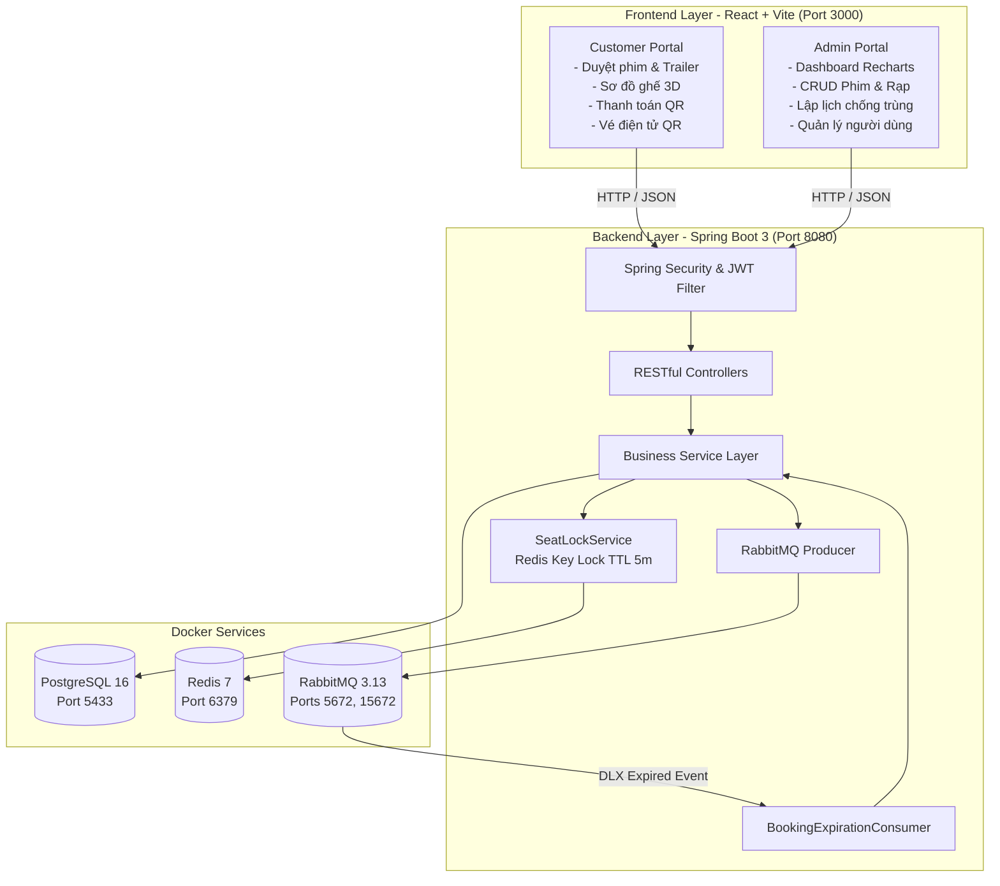

# 🎬 CINEPLEX - Hệ Thống Đặt Vé Xem Phim Trực Tuyến

> Hệ thống thương mại điện tử đặt vé xem phim trực tuyến toàn diện, phân tầng độc lập với **Spring Boot 3 (Java 21)** REST API Backend, **React (Vite + TypeScript + Tailwind CSS)** Frontend, tích hợp **PostgreSQL**, **Redis**, **RabbitMQ** và **Docker Compose**.

---

## 📌 Mục Lục

1. [Tính Năng Chính](#tinh-nang-chinh)
   - [Phân hệ Khách hàng (Customer)](#phan-he-khach-hang)
   - [Phân hệ Quản trị viên (Admin)](#phan-he-quan-tri-vien)
2. [Kiến Trúc & Công Nghệ (Tech Stack)](#kien-truc-cong-nghe)
3. [Sơ Đồ Kiến Trúc Hệ Thống](#so-do-kien-truc)
4. [Yêu Cầu Môi Trường (Prerequisites)](#yeu-cau-moi-truong)
5. [Hướng Dẫn Cài Đặt & Khởi Chạy (Quickstart)](#huong-dan-cai-dat)
6. [Tài Khoản Thử Nghiệm (Demo Accounts)](#tai-khoan-thu-nghiem)
7. [Xử Lý Nghiệp Vụ Nâng Cao](#xu-ly-nghiep-vu-nang-cao)
8. [Danh Sách RESTful API Chính](#danh-sach-api)
9. [Cấu Trúc Thư Mục Dự Án](#cau-truc-thu-muc)

---

<a id="tinh-nang-chinh"></a>
## ✨ Tính Năng Chính

<a id="phan-he-khach-hang"></a>
### 1. Phân hệ Khách hàng (Customer)
- **Tài khoản**: Đăng ký, đăng nhập, đăng xuất, lưu phiên làm việc với JWT Token, cập nhật thông tin cá nhân và đổi mật khẩu.
- **Phim**: Xem danh sách phim phân loại rõ ràng (*Đang chiếu* & *Sắp chiếu*), tìm kiếm phim theo tên/thể loại, xem trailer trực tiếp qua video modal, xem thông tin chi tiết (đạo diễn, diễn viên, thời lượng, giới hạn độ tuổi P, K, T13, T16, T18, C).
- **Rạp & Suất chiếu**: Xem danh sách cụm rạp theo tỉnh/thành phố (Hà Nội, TP. HCM, Đà Nẵng), chọn ngày xem (7 ngày tới), xem các suất chiếu theo phòng (IMAX 3D, Standard 2D, 4DX), chọn suất chiếu.
- **Sơ đồ ghế thông minh**:
  - Màn hình cong 3D sống động.
  - Phân loại ghế: **Thường (Regular)**, **VIP**, **Ghế đôi (Couple)**.
  - Trạng thái ghế thời gian thực: *Ghế trống*, *Đang chọn*, *Đang được người khác giữ chỗ (Redis Lock)*, *Đã bán*.
  - Tự động tính tiền theo hệ số ghế (VIP: $1.2\times$, Couple: $1.8\times$).
- **Đặt vé & Giữ chỗ**: Tạo đơn đặt vé, khóa giữ ghế tạm thời trong **5 phút** chống double-booking.
- **Thanh toán QR Code**: Thanh toán trực tuyến quét mã QR qua 3 cổng thanh toán: **ZaloPay**, **MoMo**, **VNPay** (kèm đồng hồ đếm ngược thời hạn thanh toán và nút mô phỏng quét thanh toán tức thì).
- **Vé điện tử (E-Ticket)**: Tự động sinh vé điện tử chuẩn Cinema Pass kèm mã QR kiểm soát vé được sinh bằng thư viện ZXing, xem chi tiết vé, in vé và tra cứu toàn bộ lịch sử mua vé.
- **Soát vé**: Giao diện tra cứu và xác thực tính hợp lệ của vé điện tử dành cho nhân viên rạp.

<a id="phan-he-quan-tri-vien"></a>
### 2. Phân hệ Quản trị viên (Admin)
- **Dashboard Thống Kê & Báo Cáo**:
  - Thẻ KPI tổng quan: Tổng doanh thu, Tổng số vé đã bán, Tổng đơn đặt vé, Tổng số khách hàng.
  - Biểu đồ vùng (Area Chart) doanh thu 7 ngày gần nhất bằng **Recharts**.
  - Bảng xếp hạng Top 5 phim ăn khách có lượng vé đặt cao nhất.
  - Thống kê tỷ lệ phân bổ trạng thái đơn đặt vé (Đã xác nhận, Chờ thanh toán, Hết hạn, Đã hủy).
- **Quản lý Phim**: Thêm / Sửa / Xóa phim, cập nhật trailer YouTube, poster dọc, thời lượng, độ tuổi quy định và trạng thái.
- **Quản lý Rạp & Phòng chiếu**: Thêm / Sửa / Xóa cụm rạp, thêm phòng chiếu theo loại (Standard 2D, IMAX 3D, 4DX), thiết lập kích thước hàng & cột ghế.
- **Quản lý Ghế (Seat Configurator)**: Bộ công cụ click / cọ gán trực quan phân loại ghế Thường, VIP, Couple cho từng phòng chiếu.
- **Quản lý Suất chiếu & Chống trùng lịch**:
  - Tạo suất chiếu, thiết lập giá vé cơ sở theo suất.
  - **Tự động phát hiện và chặn trùng lịch chiếu** tại cùng phòng chiếu ($\text{EndTime} = \text{StartTime} + \text{Duration} + 15\text{ phút dọn phòng}$).
- **Quản lý Đơn đặt vé**: Xem toàn bộ danh sách đơn đặt vé, lọc theo trạng thái, xem chi tiết vé điện tử của khách hàng.
- **Quản lý Người dùng**: Danh sách tài khoản khách hàng, chức năng Khóa / Mở khóa tài khoản người dùng vi phạm.

---

<a id="kien-truc-cong-nghe"></a>
## 🛠 Kiến Trúc & Công Nghệ (Tech Stack)

| Lớp (Layer) | Công nghệ | Chi tiết sử dụng |
| :--- | :--- | :--- |
| **Backend** | **Java 21 LTS + Spring Boot 3.4** | RESTful API, Service Layer, DTO Architecture |
| **Bảo mật** | **Spring Security + JJWT 0.12** | Xác thực Stateless JWT, phân quyền Role-based (`ROLE_CUSTOMER`, `ROLE_ADMIN`) |
| **Database ORM** | **Spring Data JPA + Hibernate** | Quản lý quan hệ thực thể, Transaction ACID |
| **Database** | **PostgreSQL 16** | Cơ sở dữ liệu quan hệ lưu trữ dữ liệu bền vững |
| **Database Migration** | **Flyway 10 (Alpine Container)** | Tự động hóa DDL Schema & nạp Seed Data trước khi Backend khởi động |
| **Caching & Lock**| **Redis 7 (Alpine)** | Khóa ghế nguyên tử (Distributed Seat Lock), TTL đếm ngược 5 phút |
| **Message Broker**| **RabbitMQ 3.13 (Management)**| Xử lý hàng đợi Dead-Letter Queue (DLX) giải phóng ghế khi hết hạn giữ chỗ |
| **QR Code Engine** | **ZXing (Zebra Crossing)** | Sinh mã QR Base64 PNG cho cổng thanh toán và vé điện tử |
| **Frontend** | **React 18 + Vite 6 + TypeScript**| Khởi động cực nhanh, Type-safety toàn diện |
| **Giao diện & UI** | **Tailwind CSS 3 + Lucide Icons** | Giao diện Cinematic Dark Mode, hiệu ứng màn chiếu cong 3D |
| **Biểu đồ** | **Recharts 2** | Biểu đồ doanh thu trực quan cho Admin Dashboard |
| **Hạ tầng** | **Docker & Docker Compose** | Điều phối container PostgreSQL, Redis và RabbitMQ |

---

<a id="so-do-kien-truc"></a>
## 📐 Sơ Đồ Kiến Trúc Hệ Thống



---

<a id="yeu-cau-moi-truong"></a>
## 📋 Yêu Cầu Môi Trường (Prerequisites)

Để chạy dự án, máy tính cần cài đặt sẵn:
- **Docker & Docker Desktop**: Hỗ trợ Docker Compose v2+
- *(Tùy chọn nếu muốn chạy không qua Docker)*: OpenJDK 21 LTS, Maven 3.9+, Node.js v20+

---

<a id="huong-dan-cai-dat"></a>
## 🚀 Hướng Dẫn Cài Đặt & Khởi Chạy (Quickstart)

Toàn bộ hệ thống (**PostgreSQL, Redis, RabbitMQ, Spring Boot Backend, React Nginx Frontend**) đã được container hóa và điều phối hoàn toàn qua **Docker Compose**.

Chỉ với **1 câu lệnh duy nhất** tại thư mục gốc `cineplex/`:

```bash
docker compose up -d --build
```

### Kiểm tra trạng thái các container:
```bash
docker compose ps
```

| Tên Container | Dịch vụ | Địa chỉ truy cập | Trạng thái |
| :--- | :--- | :--- | :--- |
| **`cineplex-frontend`** | React SPA + Nginx | **[http://localhost:3000](http://localhost:3000)** | `Up (Running)` |
| **`cineplex-backend`** | Spring Boot 3 (Java 21) | **[http://localhost:8080/api](http://localhost:8080/api)** | `Up (Running)` |
| **`cineplex-flyway`** | Flyway 10 Migration | — | `Completed (Exited 0)` |
| **`cineplex-postgres`** | PostgreSQL 16 DB | `localhost:5433` | `Up (Healthy)` |
| **`cineplex-redis`** | Redis 7 Distributed Lock | `localhost:6379` | `Up (Healthy)` |
| **`cineplex-rabbitmq`** | RabbitMQ 3.13 + Web UI | `localhost:5672`, **[http://localhost:15672](http://localhost:15672)** | `Up (Healthy)` |

---

### Dừng toàn bộ hệ thống:
```bash
docker compose down
```
*(Nếu muốn xóa sạch dữ liệu volume DB để khởi tạo lại từ đầu: `docker compose down -v`)*

---

<a id="tai-khoan-thu-nghiem"></a>
## 🔑 Tài Khoản Thử Nghiệm (Demo Accounts)

Hệ thống có sẵn 2 tài khoản mẫu phân quyền rõ ràng (trên giao diện đăng nhập có sẵn các nút bấm đăng nhập nhanh 1-click):

| Vai trò (Role) | Email | Mật khẩu | Quyền hạn |
| :--- | :--- | :--- | :--- |
| **Quản trị viên (Admin)** | `admin@cineplex.vn` | `admin123` | Toàn quyền Dashboard, CRUD phim, rạp, phòng, lịch chiếu, đơn vé, khóa/mở tài khoản |
| **Khách hàng (Customer)** | `customer@cineplex.vn` | `user123` | Đặt vé, chọn ghế, thanh toán QR, xem vé điện tử |

---

<a id="xu-ly-nghiep-vu-nang-cao"></a>
## 🧠 Xử Lý Nghiệp Vụ Nâng Cao

### 1. Cơ Chế Khóa Ghế Tạm Thời (Redis Distributed Lock)
1. Khi khách hàng chọn danh sách ghế và nhấn "Tiếp tục thanh toán", API `POST /api/bookings/hold-seats` sẽ thực hiện khóa nguyên tử (Atomic Multi-key lock) trên Redis:
   - Key: `cineplex:seat_lock:{showtimeId}:{seatId}`
   - Value: `userId`
   - TTL: `300 giây (5 phút)`
2. Nếu ghế đã bị khách hàng khác giữ hoặc đã được bán trong database, hệ thống trả về mã lỗi `409 CONFLICT` ngay lập tức.
3. Ghế đã khóa sẽ hiển thị màu cam rung nhẹ (pulse) trên sơ đồ ghế của tất cả khách hàng khác đang xem cùng suất chiếu.

### 2. Tự Động Hủy Giữ Chỗ Qua RabbitMQ Dead-Letter Queue (DLX)
1. Khi đơn đặt vé được tạo (`Booking status = PENDING`), backend gửi một message vào `cineplex.booking.hold.queue` với TTL 5 phút.
2. Khi hết 5 phút mà đơn chưa thanh toán, RabbitMQ tự động đẩy message sang Dead-Letter Exchange `cineplex.booking.expired.queue`.
3. `BookingExpirationConsumer` nhận message, kiểm tra nếu đơn vẫn `PENDING` thì cập nhật thành `EXPIRED` và xóa Redis seat lock để mở lại ghế cho khách hàng khác.

### 3. Kiểm Tra Trùng Lịch Chiếu (Showtime Collision Detection)
Khi Admin thêm hoặc sửa suất chiếu tại một phòng chiếu:
$$\text{EndTime} = \text{StartTime} + \text{MovieDuration} + 15\text{ phút dọn phòng}$$
Spring Data JPA thực hiện truy vấn kiểm tra giao thoa thời gian:
```sql
SELECT s FROM Showtime s 
WHERE s.room.id = :roomId 
  AND s.status <> 'CANCELLED'
  AND (:startTime < s.endTime AND :endTime > s.startTime)
  AND (:excludeId IS NULL OR s.id <> :excludeId)
```
Nếu phát hiện trùng lịch, hệ thống lập tức báo lỗi `ShowtimeConflictException` kèm tên phim và khung giờ bị trùng để Admin điều chỉnh.

---

<a id="danh-sach-api"></a>
## 📡 Danh Sách RESTful API Chính

### 🔐 Authentication (`/api/auth`)
- `POST /api/auth/register`: Đăng ký tài khoản khách hàng mới.
- `POST /api/auth/login`: Đăng nhập, nhận JWT Token.
- `GET /api/auth/me`: Lấy thông tin tài khoản hiện tại.
- `PUT /api/auth/profile`: Cập nhật họ tên, số điện thoại, đổi mật khẩu.

### 🎥 Movies (`/api/movies`)
- `GET /api/movies`: Lấy danh sách phim (hỗ trợ lọc `status=NOW_SHOWING|COMING_SOON` và tìm kiếm `search=...`).
- `GET /api/movies/{id}`: Xem chi tiết phim theo UUID.
- `GET /api/movies/slug/{slug}`: Xem chi tiết phim theo URL slug tiếng Việt.

### 🏢 Cinemas (`/api/cinemas`)
- `GET /api/cinemas`: Danh sách cụm rạp (lọc theo thành phố `city=...`).
- `GET /api/cinemas/{id}`: Chi tiết cụm rạp và danh sách phòng chiếu.

### ⏰ Showtimes (`/api/showtimes`)
- `GET /api/showtimes/movie/{movieId}?date=YYYY-MM-DD`: Lịch chiếu của phim theo ngày.
- `GET /api/showtimes/cinema/{cinemaId}?date=YYYY-MM-DD`: Lịch chiếu của rạp theo ngày.
- `GET /api/showtimes/{id}`: Chi tiết suất chiếu.
- `GET /api/showtimes/{id}/seats`: Lấy sơ đồ ghế và trạng thái ghế thời gian thực (AVAILABLE, HOLDING, BOOKED).

### 🎟️ Bookings & Payments (`/api/bookings`, `/api/payments`, `/api/tickets`)
- `POST /api/bookings/hold-seats`: Khóa giữ ghế trong 5 phút trên Redis.
- `POST /api/bookings`: Tạo đơn đặt vé (sinh mã `CPX-YYYYMMDD-XXXX`).
- `GET /api/bookings/my-bookings`: Danh sách vé của tôi.
- `POST /api/payments/confirm/{bookingId}`: Xác nhận thanh toán thành công và sinh vé điện tử.
- `GET /api/tickets/verify/{ticketCode}`: Xác thực tính hợp lệ của mã vé điện tử.

### 👑 Admin Console (`/api/admin` - Yêu cầu `ROLE_ADMIN`)
- `GET /api/admin/dashboard`: Thống kê KPI, doanh thu 7 ngày, top phim ăn khách.
- `POST|PUT|DELETE /api/admin/movies`: Thêm, sửa, xóa phim.
- `POST|PUT|DELETE /api/admin/cinemas`: Quản lý cụm rạp.
- `POST|PUT|DELETE /api/admin/rooms`: Quản lý phòng chiếu.
- `PUT /api/admin/rooms/seats`: Cập nhật sơ đồ ghế phòng chiếu.
- `POST|PUT|DELETE /api/admin/showtimes`: Lập lịch chiếu (kiểm tra chống trùng giờ).
- `GET /api/admin/bookings`: Quản lý danh sách toàn bộ đơn đặt vé.
- `GET /api/admin/users`: Danh sách người dùng.
- `PATCH /api/admin/users/{id}/status`: Khóa hoặc mở khóa tài khoản (`ACTIVE` / `LOCKED`).

---

<a id="cau-truc-thu-muc"></a>
## 📁 Cấu Trúc Thư Mục Dự Án

```
cineplex/
├── docker-compose.yml              # PostgreSQL, Redis, RabbitMQ, Backend, Frontend
├── README.md                       # Tài liệu hướng dẫn dự án
├── backend/                        # REST API Backend (Spring Boot 3 + Java 21)
│   ├── Dockerfile                  # Multi-stage Dockerfile cho Spring Boot 3
│   ├── pom.xml                     # Maven dependencies (JPA, Security, Redis, AMQP, ZXing)
│   └── src/main/
│       ├── java/com/cineplex/
│       │   ├── CineplexApplication.java
│       │   ├── common/             # Tầng hạ tầng chung (Cross-cutting Concerns)
│       │   │   ├── config/         # SecurityConfig, RedisConfig, RabbitMQConfig, WebMvcCorsConfig
│       │   │   ├── dto/            # PageResponse dùng chung
│       │   │   ├── exceptions/     # GlobalExceptionHandler, BadRequestException, ResourceNotFoundException
│       │   │   ├── mq/             # RabbitMQProducer
│       │   │   ├── security/       # JwtTokenProvider, UserDetailsServiceImpl, JwtAuthFilter
│       │   │   └── utils/          # QRCodeGenerator (ZXing), SlugUtils
│       │   └── features/           # Tầng tính năng độc lập (Feature Layer / Vertical Slice)
│       │       ├── admin/          # Admin Dashboard & Facade Controller
│       │       ├── auth/           # Đăng ký, Đăng nhập, Profile & JWT Response
│       │       ├── booking/        # Đặt vé, Giữ ghế Redis, Queue giải phóng ghế
│       │       ├── cinema/         # Cụm rạp, Phòng chiếu, Quản lý sơ đồ ghế
│       │       ├── movie/          # Quản lý phim, Tra cứu, Đánh giá độ tuổi
│       │       ├── payment/        # Cổng thanh toán QR Code (ZaloPay, MoMo, VNPay)
│       │       ├── showtime/       # Suất chiếu, Ghế theo suất, Chống trùng lịch
│       │       ├── ticket/         # Vé điện tử, Kiểm tra và soát vé QR
│       │       ├── upload/         # Tải lên và quản lý ảnh với MinIO
│       │       └── user/           # Quản lý người dùng, Khóa/Mở khóa tài khoản
│       └── resources/
│           ├── db/migration/       # Flyway database migrations (DDL & Seeds)
│           └── application.yml     # Cấu hình Database, Redis, RabbitMQ, JWT Secret
└── frontend/                       # Client UI (React 18 + Vite + TypeScript + Tailwind CSS)
    ├── Dockerfile                  # Multi-stage Dockerfile cho React + Nginx
    ├── nginx.conf                  # Nginx Reverse Proxy config
    ├── package.json
    ├── vite.config.ts              # Vite proxy tới http://localhost:8080
    ├── tailwind.config.js          # Cinema Dark Theme configuration
    └── src/
        ├── api/                    # Axios client & API endpoint wrappers
        ├── components/
        │   ├── common/             # Navbar, Footer, AuthModal
        │   └── customer/           # MovieCard, SeatMap (3D Curved), PaymentModal (QR), ETicketCard
        ├── contexts/               # AuthContext (JWT session state & Role checks)
        ├── pages/
        │   ├── customer/           # HomePage, MoviesPage, MovieDetailPage, BookingPage, MyTicketsPage, ProfilePage, VerifyTicketPage
        │   └── admin/              # AdminLayout, DashboardPage (Recharts), MovieManagePage, CinemaManagePage, ShowtimeManagePage, BookingManagePage, UserManagePage
        ├── types/                  # Shared TypeScript interfaces
        ├── App.tsx                 # Client & Admin router
        └── main.tsx
```

---

<a id="giay-phep"></a>
## 📜 Giấy Phép & Đóng Góp (License)

Dự án được phát hành theo giấy phép **MIT License**. Mọi đóng góp (Pull Request, Issue) đều được hoan nghênh!
