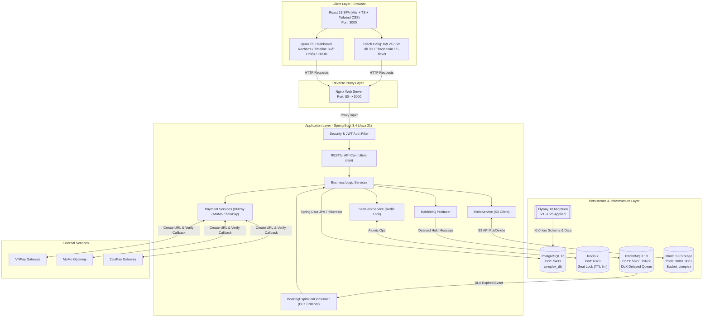
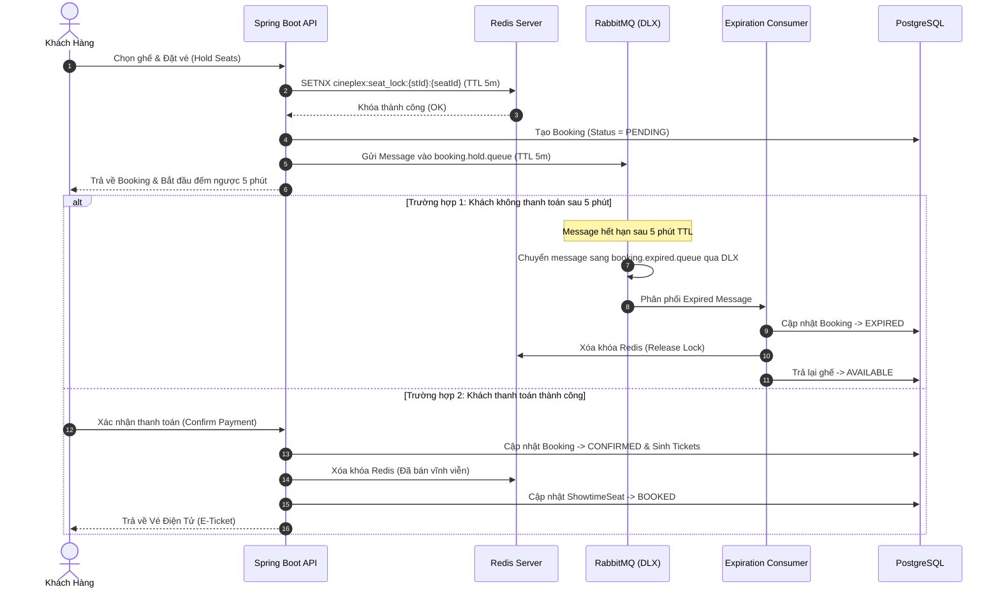

# 🎬 CINEPLEX - Hệ Thống Đặt Vé Xem Phim Trực Tuyến

> Hệ thống thương mại điện tử đặt vé xem phim trực tuyến toàn diện, phân tầng độc lập (Decoupled Architecture) với **Spring Boot 3 (Java 21 LTS)** RESTful API Backend, **React 18 (Vite 6 + TypeScript + Tailwind CSS)** Frontend, tích hợp **PostgreSQL 16**, **Redis 7**, **RabbitMQ 3.13**, **MinIO S3 Object Storage**, **Flyway 10** và điều phối toàn bộ bằng **Docker Compose**.

---

## 📌 Mục Lục

1. [Tính Năng Nổi Bật Hệ Thống](#tinh-nang-noi-bat)
   - [1. Phân hệ Khách hàng (Customer Portal)](#1-phan-he-khach-hang-customer-portal)
   - [2. Phân hệ Quản trị viên (Admin Management Portal)](#2-phan-he-quan-tri-vien-admin-management-portal)
2. [Kiến Trúc & Công Nghệ Sử Dụng (Tech Stack)](#kien-truc--cong-nghe-su-dung-tech-stack)
3. [Sơ Đồ Kiến Trúc Hệ Thống (Architecture Diagram)](#so-do-kien-truc-he-thong-architecture-diagram)
4. [Bảng Cổng Dịch Vụ & Truy Cập (Ports & Services)](#bang-cong-dich-vu--truy-cap-ports--services)
5. [Tài Khoản Thử Nghiệm (Demo Accounts)](#tai-khoan-thu-nghiem-demo-accounts)
6. [Hướng Dẫn Cài Đặt & Khởi Chạy (Quickstart)](#huong-dan-cai-dat--khoi-chay-quickstart)
   - [Cách 1: Khởi chạy toàn bộ với Docker Compose (Khuyên dùng)](#cach-1-khoi-chay-toan-bo-voi-docker-compose-khuyen-dung)
   - [Cách 2: Khởi chạy từng thành phần cục bộ (Local Development)](#cach-2-khoi-chay-tung-thanh-phan-cuc-bo-local-development)
7. [Xử Lý Nghiệp Vụ Chuyên Sâu (Deep Dive)](#xu-ly-nghiep-vu-chuyen-sau-deep-dive)
   - [1. Khóa Ghế Tạm Thời Nguyên Tử (Redis Atomic Multi-key Lock)](#1-khoa-ghe-tam-thoi-nguyen-tu-redis-atomic-multi-key-lock)
   - [2. Tự Động Thu Hồi Ghế Hết Hạn Qua RabbitMQ DLX](#2-tu-dong-thu-hoi-ghe-het-han-qua-rabbitmq-dlx)
   - [3. Thuật Toán Chống Trùng Lịch Chiếu (Showtime Collision Detection)](#3-thuat-toan-chong-trung-lich-chieu-showtime-collision-detection)
   - [4. Tích Hợp Cổng Thanh Toán Đa Kênh (VNPay, MoMo, ZaloPay)](#4-tich-hop-cong-thanh-toan-da-kanh-vnpay-momo-zalopay)
   - [5. Lưu Trữ File Phương Tiện Tập Trung Với MinIO S3](#5-luu-tru-file-phuong-tien-tap-trung-voi-minio-s3)
8. [Danh Sách RESTful API Chi Tiết](#danh-sach-restful-api-chi-tiet)
9. [Cấu Trúc Thư Mục Dự Án (Project Structure)](#cau-truc-thu-muc-du-an-project-structure)
10. [Giấy Phép (License)](#giay-phep-license)

---

<a id="tinh-nang-noi-bat"></a>
## ✨ Tính Năng Nổi Bật Hệ Thống

<a id="1-phan-he-khach-hang-customer-portal"></a>
### 1. Phân hệ Khách hàng (Customer Portal)
- **Xác thực & Hồ sơ cá nhân**:
  - Đăng ký tài khoản, đăng nhập với JWT token bảo mật, hỗ trợ nút **1-click Demo Login** tức thì.
  - Quản lý trang hồ sơ cá nhân: Cập nhật họ tên, số điện thoại và đổi mật khẩu an toàn.
- **Trang chủ Cinematic & Khám phá phim**:
  - **Hero Slider Carousel**: Banner trượt tự động chuyển động mượt mà, hiển thị các bom tấn nổi bật.
  - **Movie Slider Carousels**: 2 thanh cuộn ngang độc lập cho **Phim Đang Chiếu (Now Showing)** và **Phim Sắp Chiếu (Coming Soon)**.
  - **Trailer Video Modal**: Xem trailer trực tiếp từ YouTube với giao diện nền tối rạp chiếu hiện đại.
  - **Thông tin chi tiết phim**: Đạo diễn, diễn viên, thời lượng, ngày khởi chiếu tiếng Việt và phân loại nhãn độ tuổi theo tiêu chuẩn Việt Nam (**P, K, T13, T16, T18**).
- **Lịch chiếu & Chọn rạp**:
  - Xem danh sách cụm rạp phân theo tỉnh/thành phố lớn (**Hà Nội, TP. Hồ Chí Minh, Đà Nẵng**).
  - Chọn ngày xem (7 ngày tới), lọc suất chiếu theo định dạng phòng (**IMAX Laser 3D, Standard 2D, 4DX Motion**).
  - Tự động nhận diện và chặn đặt vé đối với các suất chiếu đã diễn ra trong quá khứ.
- **Sơ đồ ghế thông minh 3D (Interactive Seat Map)**:
  - Hiệu ứng màn chiếu cong 3D sống động (Screen Curve effect).
  - Phân loại ghế trực quan: **Ghế Thường (Regular)**, **Ghế VIP ($1.2\times$)**, **Ghế đôi (Couple $1.8\times$)**.
  - Trạng thái ghế thời gian thực: *Ghế trống*, *Đang chọn*, *Đang được người khác giữ chỗ (Redis Lock - viền cam nhấp nháy)*, *Đã bán*.
  - Tự động làm mới trạng thái ghế định kỳ 10 giây; giới hạn tối đa 8 ghế/đơn hàng.
- **Quy trình Đặt vé & Giữ chỗ chống Double-Booking**:
  - Khóa giữ ghế nguyên tử trong **5 phút (300 giây)** trên Redis.
  - Tự động sinh mã đơn hàng chuẩn rạp phim `CPX-YYYYMMDD-XXXX`.
- **Thanh toán trực tuyến Đa Cổng (Payment Gateways)**:
  - Hỗ trợ 3 cổng thanh toán điện tử hàng đầu: **ZaloPay**, **MoMo**, **VNPay**.
  - Tích hợp cổng thanh toán thực tế / sandbox: sinh URL thanh toán có chữ ký bảo mật, mở cổng thanh toán qua tab mới hoặc quét mã QR.
  - Màn hình chờ thanh toán thông minh: Đồng hồ đếm ngược 5 phút thời hạn giữ ghế, cơ chế **Polling tự động kiểm tra trạng thái đơn hàng**, cùng nút mô phỏng Sandbox (thành công/hủy giao dịch) phục vụ thử nghiệm.
  - **Trang Callback chuyên biệt (`/payment/callback`)**: Nhận diện nguồn cổng, xác thực chữ ký (Checksum), cập nhật đơn đặt vé sang `CONFIRMED` và trả về vé ngay lập tức.
- **Vé điện tử & Tra cứu (E-Ticket & Pass)**:
  - Sinh vé điện tử chuẩn phong cách Cinema Pass với mã QR code soát vé.
  - Trang **Vé của tôi (`/my-tickets`)**: Quản lý lịch sử vé đã mua có phân trang, xem chi tiết và in vé trực tiếp từ trình duyệt.

<a id="2-phan-he-quan-tri-vien-admin-management-portal"></a>
### 2. Phân hệ Quản trị viên (Admin Management Portal)
- **Dashboard Thống Kê & Báo Cáo Chuyên Sâu**:
  - Thẻ 6 chỉ số KPI then chốt: **Tổng doanh thu**, **Tổng vé đã bán**, **Tổng đơn đặt vé**, **Tổng khách hàng**, **Tổng số phim**, **Tổng số cụm rạp**.
  - **Biểu đồ vùng (Area Chart) doanh thu 7 ngày gần nhất** được dựng bằng thư viện **Recharts**.
  - Bảng xếp hạng **Top 5 phim ăn khách nhất** dựa trên lượng vé và tổng doanh thu thu về.
  - Biểu đồ phân bổ tỷ lệ trạng thái đơn đặt vé (*Đã xác nhận, Chờ thanh toán, Hết hạn, Đã hủy*).
- **Quản lý Suất chiếu & Interactive Timeline (Dòng thời gian trực quan)**:
  - **Chế độ Timeline trực quan (Visual Operating Timeline)**: Trải dài từ 08:00 đến 01:00 sáng hôm sau, hiển thị các khối phim theo phòng chiếu với bảng màu nhận diện sinh động.
  - **Khối đệm dọn phòng 15 phút (Cleaning Buffer)**: Tự động hiển thị và tính toán thời gian nghỉ giữa các suất chiếu.
  - **Chế độ Danh sách (Table View)**: Phân trang linh hoạt, hỗ trợ tìm kiếm phim và lọc theo rạp chiếu.
  - **Thuật toán chặn trùng lịch chiếu tự động (Collision Detection)**: Tính toán $\text{EndTime} = \text{StartTime} + \text{Duration} + 15\text{ phút dọn phòng}$, ngăn chặn tức thì xung đột lịch chiếu cùng phòng trên cơ sở dữ liệu.
- **Quản lý Phim (Movie Management)**:
  - Thêm, sửa, xóa phim; cập nhật trailer YouTube, thời lượng, ngày khởi chiếu, ngày kết thúc và nhãn độ tuổi.
  - Tải lên trực tiếp **Poster dọc** và **Banner ngang** lên **MinIO Object Storage** với dung lượng hỗ trợ tối đa 25MB.
  - Bộ lọc trạng thái (*Tất cả, Đang chiếu, Sắp chiếu, Ngừng chiếu*), tìm kiếm tên phim và sắp xếp đa tiêu chí.
- **Quản lý Cụm Rạp & Phòng Chiếu (Cinema & Room Management)**:
  - Thêm, sửa, xóa cụm rạp tại các thành phố; tải ảnh rạp lên MinIO S3.
  - Thêm phòng chiếu theo loại công nghệ (**Standard 2D, IMAX 3D, 4DX**), cấu hình số hàng và số cột ghế.
  - **Bộ công cụ trực quan cấu hình ghế (Seat Configurator)**: Sử dụng công cụ cọ vẽ (brush) gán loại ghế Regular, VIP, Couple cho từng vị trí ghế trong phòng.
- **Quản lý Đơn đặt vé Toàn hệ thống (Booking Management)**:
  - Danh sách đơn đặt vé có phân trang, lọc theo trạng thái (`CONFIRMED`, `PENDING`, `EXPIRED`, `CANCELLED`), tìm kiếm theo mã đơn hoặc email khách hàng.
  - Xem popup chi tiết vé điện tử đầy đủ thông tin khách hàng, số ghế và thanh toán.
- **Quản lý Người dùng (User Management)**:
  - Danh sách người dùng, hiển thị vai trò (`ROLE_ADMIN`, `ROLE_CUSTOMER`) và trạng thái tài khoản.
  - Khóa (`LOCKED`) hoặc Mở khóa (`ACTIVE`) tài khoản vi phạm chỉ với 1 cú click kèm hộp thoại xác nhận an toàn.
- **Soát Vé Điện Tử Cho Nhân Viên Rạp (`/verify-ticket`)**:
  - Giao diện tra cứu và xác thực tính hợp lệ của vé điện tử thông qua mã vé `TKT-XXXXXXXX`.
  - Phân quyền chặt chẽ: chỉ tài khoản có vai trò `ROLE_ADMIN` (nhân viên/quản trị viên) mới có quyền truy cập và kiểm tra vé.

---

<a id="kien-truc--cong-nghe-su-dung-tech-stack"></a>
## 🛠 Kiến Trúc & Công Nghệ Sử Dụng (Tech Stack)

| Lớp (Layer) | Công nghệ | Phiên bản | Chi tiết sử dụng |
| :--- | :--- | :--- | :--- |
| **Backend Framework** | **Spring Boot** | `3.4.2` | RESTful API, Controller, Service Layer, DTO Pattern |
| **Ngôn ngữ Backend** | **Java** | `21 LTS` | Records, Pattern Matching, Stream API, Virtual Threads ready |
| **Bảo mật & Auth** | **Spring Security + JJWT** | `0.12.6` | Stateless JWT Bearer Token, Phân quyền Role-based (`ROLE_CUSTOMER`, `ROLE_ADMIN`) |
| **Database ORM** | **Spring Data JPA + Hibernate** | `6.x` | Ánh xạ thực thể quan hệ, Quản lý giao dịch ACID, Custom JPQL queries |
| **Cơ sở dữ liệu** | **PostgreSQL** | `16-alpine` | Lưu trữ dữ liệu quan hệ bền vững, toàn vẹn khóa ngoại |
| **Database Migration** | **Flyway** | `10-alpine` | Quản lý phiên bản Schema DDL và tự động nạp dữ liệu mẫu (V1 -> V5) |
| **Distributed Caching & Lock** | **Redis** | `7-alpine` | Khóa ghế nguyên tử (Atomic Multi-key Lock), TTL 300s đếm ngược |
| **Message Broker** | **RabbitMQ** | `3.13-management` | Xử lý Dead-Letter Queue (DLX) giải phóng ghế khi hết hạn giữ chỗ |
| **Object Storage** | **MinIO** | `latest` | Lưu trữ tập trung Poster, Banner phim và Ảnh rạp qua chuẩn giao thức S3 |
| **Frontend Framework** | **React** | `18.3.1` | Kiến trúc Component, Context API (`AuthContext`), Custom Hooks |
| **Công cụ Build Frontend** | **Vite** | `6.1.0` | Khởi chạy dev server siêu tốc, đóng gói tối ưu production |
| **Ngôn ngữ Frontend** | **TypeScript** | `5.7.3` | Type-safety toàn diện giữa giao diện và định nghĩa API |
| **Giao diện & UI** | **Tailwind CSS** | `3.4.17` | Cinema Design System (Màu Emerald & Amber chủ đạo, Slate background) |
| **Icon System** | **Lucide React** | `0.475.0` | Bộ icon vector hiện đại, sắc nét |
| **Đồ thị Thống kê** | **Recharts** | `2.15.1` | Biểu đồ vùng (Area Chart) và cột thể hiện doanh thu trên Dashboard |
| **Cổng Thanh Toán** | **VNPay, MoMo, ZaloPay** | Sandbox/API | Xử lý tạo link thanh toán, xác thực chữ ký số HMAC-SHA256/512 |
| **Web Server / Reverse Proxy** | **Nginx** | `alpine` | Phục vụ static SPA bundle và reverse proxy request `/api` sang backend |
| **Container Hóa** | **Docker & Docker Compose** | `v2+` | Điều phối toàn diện 7 container trong môi trường cô lập |

---

<a id="so-do-kien-truc-he-thong-architecture-diagram"></a>
## 📐 Sơ Đồ Kiến Trúc Hệ Thống (Architecture Diagram)


```mermaid
graph TB
    subgraph Client ["Client Layer - Browser"]
        SPA["React 18 SPA (Vite + TS + Tailwind CSS)<br/>Port: 3000"]
        CUS_UI["Khách Hàng: Đặt vé / Sơ đồ 3D / Thanh toán / E-Ticket"]
        ADM_UI["Quản Trị: Dashboard Recharts / Timeline Suất Chiếu / CRUD"]
        SPA --> CUS_UI
        SPA --> ADM_UI
    end

    subgraph Gateway ["Reverse Proxy Layer"]
        NGINX["Nginx Web Server<br/>Port: 80 -> 3000"]
    end

    subgraph BackendApp ["Application Layer - Spring Boot 3.4 (Java 21)"]
        AUTH_FILTER["Security & JWT Auth Filter"]
        REST_CTRL["RESTful API Controllers (/api)"]
        SVC["Business Logic Services"]
        SEAT_LOCK["SeatLockService (Redis Lock)"]
        MQ_PUB["RabbitMQ Producer"]
        MQ_SUB["BookingExpirationConsumer (DLX Listener)"]
        MINIO_SVC["MinioService (S3 Client)"]
        PAY_SVC["Payment Services (VNPay / MoMo / ZaloPay)"]

        AUTH_FILTER --> REST_CTRL
        REST_CTRL --> SVC
        SVC --> SEAT_LOCK
        SVC --> MQ_PUB
        SVC --> MINIO_SVC
        SVC --> PAY_SVC
        MQ_SUB --> SVC
    end

    subgraph DataStorage ["Persistence & Infrastructure Layer"]
        DB[("PostgreSQL 16<br/>Port: 5433<br/>cineplex_db")]
        FLYWAY[["Flyway 10 Migration<br/>V1 -> V5 Applied"]]
        REDIS[("Redis 7<br/>Port: 6379<br/>Seat Lock (TTL 5m)")]
        RABBIT[("RabbitMQ 3.13<br/>Ports: 5672, 15672<br/>DLX Delayed Queue")]
        MINIO[("MinIO S3 Storage<br/>Ports: 9000, 9001<br/>Bucket: cineplex")]
    end

    subgraph External ["External Services"]
        VNPAY["VNPay Gateway"]
        MOMO["MoMo Gateway"]
        ZALOPAY["ZaloPay Gateway"]
    end

    CUS_UI & ADM_UI -->|HTTP Requests| NGINX
    NGINX -->|Proxy /api/*| AUTH_FILTER
    SVC -->|Spring Data JPA / Hibernate| DB
    FLYWAY -.->|Khởi tạo Schema & Data| DB
    SEAT_LOCK <-->|Atomic Ops| REDIS
    MQ_PUB -->|Delayed Hold Message| RABBIT
    RABBIT -->|DLX Expired Event| MQ_SUB
    MINIO_SVC <-->|S3 API Put/Delete| MINIO
    PAY_SVC <-->|Create URL & Verify Callback| VNPAY & MOMO & ZALOPAY
```

---

<a id="bang-cong-dich-vu--truy-cap-ports--services"></a>
## 🌐 Bảng Cổng Dịch Vụ & Truy Cập (Ports & Services)

Khi khởi chạy hệ thống thông qua Docker Compose, các dịch vụ sẽ lắng nghe trên các cổng sau:

| Dịch vụ | Tên Container | Cổng Host : Container | Địa chỉ truy cập / Ghi chú |
| :--- | :--- | :--- | :--- |
| **Frontend Web** | `cineplex-frontend` | `3000:80` | **[http://localhost:3000](http://localhost:3000)** (Giao diện người dùng) |
| **Backend API** | `cineplex-backend` | `8080:8080` | **[http://localhost:8080/api](http://localhost:8080/api)** (RESTful API Endpoint) |
| **MinIO S3 Console** | `cineplex-minio` | `9001:9001` | **[http://localhost:9001](http://localhost:9001)** (User: `minioadmin` / Pass: `minioadmin`) |
| **MinIO S3 API** | `cineplex-minio` | `9000:9000` | `http://localhost:9000` (API lưu trữ tệp đa phương tiện) |
| **RabbitMQ Management** | `cineplex-rabbitmq` | `15672:15672` | **[http://localhost:15672](http://localhost:15672)** (User: `guest` / Pass: `guest`) |
| **RabbitMQ AMQP** | `cineplex-rabbitmq` | `5672:5672` | `localhost:5672` (Cổng giao thức hàng đợi AMQP) |
| **Redis Server** | `cineplex-redis` | `6379:6379` | `localhost:6379` (Bộ nhớ đệm & Khóa phân tán) |
| **PostgreSQL DB** | `cineplex-postgres` | `5433:5432` | `localhost:5433` (Database: `cineplex_db`, User: `postgres`) |
| **Flyway Migration** | `cineplex-flyway` | — | Chạy tự động migrate V1 đến V5 rồi kết thúc (`Exit 0`) |

---

<a id="tai-khoan-thu-nghiem-demo-accounts"></a>
## 🔑 Tài Khoản Thử Nghiệm (Demo Accounts)

Hệ thống đã chuẩn bị sẵn 2 tài khoản mẫu trong cơ sở dữ liệu (**trên giao diện đăng nhập có sẵn 2 nút 1-Click để tự động điền và đăng nhập ngay lập tức**):

| Vai trò (Role) | Email | Mật khẩu | Quyền hạn & Chức năng |
| :--- | :--- | :--- | :--- |
| **Quản trị viên (Admin)** | `admin@cineplex.vn` | `admin123` | Toàn quyền Dashboard thống kê, quản lý phim (upload ảnh MinIO), cụm rạp, phòng, timeline suất chiếu chống trùng giờ, quản lý danh sách đơn vé, khóa/mở tài khoản người dùng, soát vé điện tử |
| **Khách hàng (Customer)** | `customer@cineplex.vn` | `user123` | Xem phim, chọn suất chiếu, chọn ghế 3D, giữ ghế Redis 5 phút, thanh toán thử nghiệm qua VNPay/MoMo/ZaloPay, nhận vé điện tử kèm mã QR |

---

<a id="huong-dan-cai-dat--khoi-chay-quickstart"></a>
## 🚀 Hướng Dẫn Cài Đặt & Khởi Chạy (Quickstart)

### Yêu Cầu Cài Đặt Sẵn:
- **Docker Desktop** (hỗ trợ Docker Compose v2 trở lên)
- *(Tùy chọn nếu chạy thủ công)*: JDK 21 LTS, Maven 3.9+, Node.js 20+, PostgreSQL 16, Redis 7, RabbitMQ 3.13, MinIO Server.

---

<a id="cach-1-khoi-chay-toan-bo-voi-docker-compose-khuyen-dung"></a>
### Cách 1: Khởi chạy toàn bộ với Docker Compose (Khuyên dùng)

Toàn bộ hệ thống (**PostgreSQL, Redis, RabbitMQ, MinIO, Flyway, Spring Boot Backend, React Nginx Frontend**) sẽ được build và khởi động hoàn toàn tự động chỉ với **1 câu lệnh duy nhất**.

1. **Mở Terminal tại thư mục gốc dự án `cineplex/`:**
   ```bash
   docker compose up -d --build
   ```

2. **Kiểm tra trạng thái các container:**
   ```bash
   docker compose ps
   ```
   *Tất cả các dịch vụ `cineplex-postgres`, `cineplex-redis`, `cineplex-rabbitmq`, `cineplex-minio`, `cineplex-backend`, `cineplex-frontend` đều ở trạng thái `Up (healthy)` hoặc `Up`, riêng `cineplex-flyway` ở trạng thái `Exited (0)` là thành công.*

3. **Truy cập ứng dụng:**
   - **Giao diện người dùng (Frontend)**: [http://localhost:3000](http://localhost:3000)
   - **Backend API Context**: [http://localhost:8080/api](http://localhost:8080/api)
   - **MinIO Web Console**: [http://localhost:9001](http://localhost:9001)
   - **RabbitMQ Dashboard**: [http://localhost:15672](http://localhost:15672)

4. **Dừng toàn bộ hệ thống:**
   ```bash
   docker compose down
   ```
   *(Nếu muốn xóa sạch toàn bộ dữ liệu database và volumes để khởi tạo lại từ đầu, thêm cờ `-v`: `docker compose down -v`)*

---

<a id="cach-2-khoi-chay-tung-thanh-phan-cuc-bo-local-development"></a>
### Cách 2: Khởi chạy từng thành phần cục bộ (Local Development)

Nếu bạn muốn debug trực tiếp backend trong IntelliJ IDEA / Eclipse hoặc frontend với Vite HMR:

#### Bước 1: Khởi chạy các dịch vụ hạ tầng (Database, Cache, Queue, MinIO)
Tại thư mục gốc dự án:
```bash
docker compose up -d postgres redis rabbitmq minio flyway
```

#### Bước 2: Chạy Backend Spring Boot
Mở terminal tại thư mục `backend/`:
```bash
cd backend
./mvnw clean spring-boot:run
```
*(Trên Windows PowerShell: `.\mvnw.cmd clean spring-boot:run`)*
Backend sẽ khởi chạy tại cổng `8080` với context-path `/api`.

#### Bước 3: Chạy Frontend React
Mở một cửa sổ terminal mới tại thư mục `frontend/`:
```bash
cd frontend
npm install
npm run dev
```
Frontend sẽ khởi chạy tại [http://localhost:3000](http://localhost:3000) và tự động proxy các request `/api` sang backend `http://localhost:8080`.

---

<a id="xu-ly-nghiep-vu-chuyen-sau-deep-dive"></a>
## 🧠 Xử Lý Nghiệp Vụ Chuyên Sâu (Deep Dive)

<a id="1-khoa-ghe-tam-thoi-nguyen-tu-redis-atomic-multi-key-lock"></a>
### 1. Khóa Ghế Tạm Thời Nguyên Tử (Redis Atomic Multi-key Lock)
Trong bài toán đặt vé xem phim, hiện tượng **Double-Booking (nhiều khách hàng cùng chọn và thanh toán 1 ghế)** là rủi ro lớn nhất. Hệ thống Cineplex giải quyết triệt để vấn đề này bằng Redis Distributed Lock:
1. Khi khách hàng bấm "Tiếp tục thanh toán", API `POST /api/bookings/hold-seats` được gọi.
2. `SeatLockService` thực hiện duyệt qua từng ghế trong danh sách và gọi lệnh nguyên tử `SETNX` (Set if Not Exists) với key định danh:
   - **Redis Key**: `cineplex:seat_lock:{showtimeId}:{seatId}`
   - **Value**: `userId`
   - **TTL (Time to Live)**: `300 giây (5 phút)`
3. **Cơ chế Rollback nguyên tử**: Nếu phát hiện dù chỉ 1 ghế trong danh sách đã bị người khác khóa (`SETNX` trả về false), hệ thống sẽ lập tức xóa bỏ (rollback) toàn bộ các khóa ghế đã giữ trước đó trong lượt gọi này và trả về lỗi `409 Conflict`.
4. Ghế đã khóa sẽ phản ánh trạng thái `HOLDING` và nhấp nháy cam trên sơ đồ ghế của tất cả người dùng khác đang mở suất chiếu đó.

<a id="2-tu-dong-thu-hoi-ghe-het-han-qua-rabbitmq-dlx"></a>
### 2. Tự Động Thu Hồi Ghế Hết Hạn Qua RabbitMQ DLX
Khi khách hàng giữ ghế nhưng rời khỏi trang hoặc không hoàn tất thanh toán sau 5 phút:
1. Khi đơn đặt vé được tạo (`Booking status = PENDING`), backend gửi một thông điệp vào hàng đợi `cineplex.booking.hold.queue`.
2. Hàng đợi này được cấu hình:
   - `x-message-ttl: 300000` (5 phút).
   - `x-dead-letter-exchange: cineplex.booking.exchange`
   - `x-dead-letter-routing-key: booking.process.expired`
3. Sau 5 phút, RabbitMQ tự động đẩy message sang hàng đợi Dead-Letter `cineplex.booking.expired.queue`.
4. `BookingExpirationConsumer` bắt được sự kiện hết hạn, kiểm tra nếu trạng thái đơn đặt vẫn là `PENDING`:
   - Chuyển trạng thái đơn sang `EXPIRED`.
   - Gọi `seatLockService.releaseSeats()` xóa key trên Redis.
   - Giải phóng các ghế tương ứng trong bảng `showtime_seats` về trạng thái `AVAILABLE`.


```mermaid
sequenceDiagram
    autonumber
    actor Customer as Khách Hàng
    participant Backend as Spring Boot API
    participant Redis as Redis Server
    participant Rabbit as RabbitMQ (DLX)
    participant Consumer as Expiration Consumer
    participant DB as PostgreSQL

    Customer->>Backend: Chọn ghế & Đặt vé (Hold Seats)
    Backend->>Redis: SETNX cineplex:seat_lock:{stId}:{seatId} (TTL 5m)
    Redis-->>Backend: Khóa thành công (OK)
    Backend->>DB: Tạo Booking (Status = PENDING)
    Backend->>Rabbit: Gửi Message vào booking.hold.queue (TTL 5m)
    Backend-->>Customer: Trả về Booking & Bắt đầu đếm ngược 5 phút
    
    alt Trường hợp 1: Khách không thanh toán sau 5 phút
        Note over Rabbit: Message hết hạn sau 5 phút TTL
        Rabbit->>Rabbit: Chuyển message sang booking.expired.queue qua DLX
        Rabbit->>Consumer: Phân phối Expired Message
        Consumer->>DB: Cập nhật Booking -> EXPIRED
        Consumer->>Redis: Xóa khóa Redis (Release Lock)
        Consumer->>DB: Trả lại ghế -> AVAILABLE
    else Trường hợp 2: Khách thanh toán thành công
        Customer->>Backend: Xác nhận thanh toán (Confirm Payment)
        Backend->>DB: Cập nhật Booking -> CONFIRMED & Sinh Tickets
        Backend->>Redis: Xóa khóa Redis (Đã bán vĩnh viễn)
        Backend->>DB: Cập nhật ShowtimeSeat -> BOOKED
        Backend-->>Customer: Trả về Vé Điện Tử (E-Ticket)
    end
```

<a id="3-thuat-toan-chong-trung-lich-chieu-showtime-collision-detection"></a>
### 3. Thuật Toán Chống Trùng Lịch Chiếu (Showtime Collision Detection)
Khi Quản trị viên lên lịch chiếu cho bất kỳ phòng chiếu nào:
- Hệ thống tự động tính thời gian kết thúc:
  $$\text{EndTime} = \text{StartTime} + \text{MovieDuration} + 15\text{ phút (Cleaning Buffer)}$$
- Trước khi lưu vào Database, Spring Data JPA kiểm tra xung đột thời gian bằng câu lệnh truy vấn giao thoa khoảng thời gian:
  ```sql
  SELECT s FROM Showtime s
  WHERE s.room.id = :roomId
    AND s.status <> 'CANCELLED'
    AND (:startTime < s.endTime AND :endTime > s.startTime)
    AND (:excludeId IS NULL OR s.id <> :excludeId)
  ```
- Nếu xảy ra xung đột dù chỉ 1 phút, hệ thống ném ra `ShowtimeConflictException` kèm thông báo chi tiết: phòng chiếu, tên bộ phim đang bị trùng và khung giờ chính xác để quản trị viên điều chỉnh.

<a id="4-tich-hop-cong-thanh-toan-da-kanh-vnpay-momo-zalopay"></a>
### 4. Tích Hợp Cổng Thanh Toán Đa Kênh (VNPay, MoMo, ZaloPay)
- **Tạo URL thanh toán có chữ ký bảo mật**:
  - VNPay: Ký thuật toán HMAC-SHA512 với `vnp_HashSecret`.
  - MoMo: Ký HMAC-SHA256 với `secretKey` theo chuẩn định dạng chuỗi tham số của MoMo.
  - ZaloPay: Sinh `mac` HMAC-SHA256 dựa trên `app_id`, `app_trans_id`, `app_user`, `amount`, `app_time`, `embed_data` và `item`.
- **Đồng bộ hóa kết quả giao dịch**:
  - Người dùng quét mã hoặc xác nhận thanh toán trên cổng -> Cổng thanh toán chuyển hướng về frontend tại `/payment/callback`.
  - Frontend gửi toàn bộ query params về endpoint `GET /api/payments/callback`.
  - Backend đối soát lại chữ ký số (Checksum Verification) để ngăn ngừa gian lận giả mạo tham số `amount` hoặc mã kết quả `status`.
  - Nếu hợp lệ, hệ thống hoàn tất đơn vé, sinh mã vé điện tử `TKT-XXXXXXXX` và hiển thị trực tiếp cho khách hàng.

<a id="5-luu-tru-file-phuong-tien-tap-trung-voi-minio-s3"></a>
### 5. Lưu Trữ File Phương Tiện Tập Trung Với MinIO S3
- Toàn bộ hình ảnh poster phim, banner ngang và hình ảnh cụm rạp được upload trực tiếp thông qua API `/api/upload` vào dịch vụ lưu trữ đối tượng **MinIO** (tương thích hoàn toàn chuẩn Amazon S3).
- Dung lượng upload tối đa lên đến **25MB**, tự động cấu hình bucket public `cineplex` giúp ảnh hiển thị với tốc độ cao mà không làm phình to dung lượng container ứng dụng.

---

<a id="danh-sach-restful-api-chi-tiet"></a>
## 📡 Danh Sách RESTful API Chi Tiết

### 🔐 1. Xác thực & Tài khoản (`/api/auth`)
| Phương thức | Endpoint | Yêu cầu quyền | Chức năng |
| :--- | :--- | :--- | :--- |
| `POST` | `/api/auth/register` | Công khai | Đăng ký tài khoản khách hàng mới |
| `POST` | `/api/auth/login` | Công khai | Đăng nhập hệ thống, nhận JWT Token |
| `GET` | `/api/auth/me` | User đăng nhập | Lấy thông tin tài khoản hiện tại |
| `PUT` | `/api/auth/profile` | User đăng nhập | Cập nhật họ tên, số điện thoại, đổi mật khẩu |

### 🎥 2. Quản lý Phim (`/api/movies`)
| Phương thức | Endpoint | Yêu cầu quyền | Chức năng |
| :--- | :--- | :--- | :--- |
| `GET` | `/api/movies` | Công khai | Lấy danh sách phim (phân trang, lọc `status`, tìm kiếm `search`, sắp xếp) |
| `GET` | `/api/movies/{id}` | Công khai | Chi tiết phim theo UUID |
| `GET` | `/api/movies/slug/{slug}` | Công khai | Chi tiết phim theo URL slug tiếng Việt |

### 🏢 3. Cụm Rạp & Phòng Chiếu (`/api/cinemas`)
| Phương thức | Endpoint | Yêu cầu quyền | Chức năng |
| :--- | :--- | :--- | :--- |
| `GET` | `/api/cinemas` | Công khai | Lấy danh sách cụm rạp (lọc theo thành phố `city`) |
| `GET` | `/api/cinemas/{id}` | Công khai | Xem chi tiết cụm rạp |
| `GET` | `/api/cinemas/{id}/rooms` | Công khai | Danh sách phòng chiếu của cụm rạp |

### ⏰ 4. Lịch Chiếu & Sơ Đồ Ghế (`/api/showtimes`)
| Phương thức | Endpoint | Yêu cầu quyền | Chức năng |
| :--- | :--- | :--- | :--- |
| `GET` | `/api/showtimes/movie/{movieId}?date=YYYY-MM-DD` | Công khai | Lịch chiếu của phim theo ngày |
| `GET` | `/api/showtimes/cinema/{cinemaId}?date=YYYY-MM-DD` | Công khai | Lịch chiếu của rạp theo ngày |
| `GET` | `/api/showtimes/{id}` | Công khai | Chi tiết suất chiếu |
| `GET` | `/api/showtimes/{id}/seats` | Công khai | Lấy sơ đồ ghế & trạng thái thời gian thực (`AVAILABLE`, `HOLDING`, `BOOKED`) |

### 🎟️ 5. Đặt Vé & Hàng Đợi (`/api/bookings`)
| Phương thức | Endpoint | Yêu cầu quyền | Chức năng |
| :--- | :--- | :--- | :--- |
| `POST` | `/api/bookings/hold-seats` | User đăng nhập | Khóa giữ ghế tạm thời trong 5 phút trên Redis |
| `POST` | `/api/bookings` | User đăng nhập | Tạo đơn đặt vé mới (sinh mã `CPX-YYYYMMDD-XXXX`) |
| `GET` | `/api/bookings/{id}` | User đăng nhập | Lấy thông tin chi tiết đơn đặt vé theo ID |
| `GET` | `/api/bookings/code/{code}` | User đăng nhập | Tra cứu đơn đặt vé theo mã đơn |
| `POST` | `/api/bookings/{id}/cancel` | User đăng nhập | Hủy đơn đặt vé và giải phóng ghế |
| `GET` | `/api/bookings/my-bookings` | User đăng nhập | Lấy danh sách vé đã đặt của khách hàng hiện tại |

### 💳 6. Cổng Thanh Toán (`/api/payments`)
| Phương thức | Endpoint | Yêu cầu quyền | Chức năng |
| :--- | :--- | :--- | :--- |
| `POST` | `/api/payments/create-url/{bookingId}?method=...` | User đăng nhập | Sinh URL chuyển tiếp sang cổng VNPay / MoMo / ZaloPay |
| `GET` | `/api/payments/callback` | Công khai | Nhận callback từ cổng thanh toán, đối soát chữ ký số |
| `POST` | `/api/payments/confirm/{bookingId}` | User đăng nhập | Xác nhận thanh toán thành công (dành cho mô phỏng Sandbox) |
| `GET` | `/api/payments/booking/{bookingId}` | User đăng nhập | Lấy thông tin thanh toán theo đơn đặt vé |
| `PUT` | `/api/payments/method/{bookingId}?method=...` | User đăng nhập | Thay đổi phương thức thanh toán của đơn vé |

### 🎫 7. Soát Vé Điện Tử (`/api/tickets`)
| Phương thức | Endpoint | Yêu cầu quyền | Chức năng |
| :--- | :--- | :--- | :--- |
| `GET` | `/api/tickets/verify/{ticketCode}` | `ROLE_ADMIN` | Kiểm tra tính hợp lệ và thông tin vé điện tử tại quầy |

### ☁️ 8. Tải Lên Phương Tiện MinIO (`/api/upload`)
| Phương thức | Endpoint | Yêu cầu quyền | Chức năng |
| :--- | :--- | :--- | :--- |
| `POST` | `/api/upload` | `ROLE_ADMIN` | Tải lên file ảnh (Multipart form, tối đa 25MB) lên MinIO |
| `DELETE` | `/api/upload?url=...` | `ROLE_ADMIN` | Xóa file ảnh khỏi bucket MinIO |

### 👑 9. Quản Trị Hệ Thống (`/api/admin` - Yêu cầu `ROLE_ADMIN`)
| Phương thức | Endpoint | Chức năng |
| :--- | :--- | :--- |
| `GET` | `/api/admin/dashboard` | Thống kê số liệu KPI, biểu đồ doanh thu 7 ngày, Top 5 phim |
| `POST` | `/api/admin/movies` | Thêm phim mới |
| `PUT` | `/api/admin/movies/{id}` | Cập nhật thông tin phim |
| `DELETE` | `/api/admin/movies/{id}` | Xóa phim |
| `POST` | `/api/admin/cinemas` | Thêm cụm rạp mới |
| `PUT` | `/api/admin/cinemas/{id}` | Sửa thông tin cụm rạp |
| `DELETE` | `/api/admin/cinemas/{id}` | Xóa cụm rạp |
| `POST` | `/api/admin/rooms` | Thêm phòng chiếu mới |
| `PUT` | `/api/admin/rooms/{id}` | Sửa thông tin phòng chiếu |
| `DELETE` | `/api/admin/rooms/{id}` | Xóa phòng chiếu |
| `GET` | `/api/admin/rooms/{roomId}/seats` | Lấy danh sách layout ghế của phòng chiếu |
| `PUT` | `/api/admin/rooms/seats` | Lưu cấu hình loại ghế (Regular, VIP, Couple) cho phòng |
| `GET` | `/api/admin/showtimes` | Quản lý danh sách suất chiếu (phân trang, lọc rạp, tìm kiếm) |
| `POST` | `/api/admin/showtimes` | Tạo suất chiếu mới (có kiểm tra chống trùng lịch chiếu) |
| `PUT` | `/api/admin/showtimes/{id}` | Cập nhật suất chiếu (kiểm tra chống trùng lịch chiếu) |
| `DELETE` | `/api/admin/showtimes/{id}` | Hủy suất chiếu |
| `GET` | `/api/admin/bookings` | Quản lý danh sách toàn bộ đơn đặt vé (phân trang, lọc status, search) |
| `GET` | `/api/admin/bookings/{id}` | Xem chi tiết đơn vé |
| `GET` | `/api/admin/users` | Quản lý danh sách người dùng (phân trang, tìm kiếm, lọc status) |
| `PATCH` | `/api/admin/users/{id}/status` | Khóa hoặc Mở khóa tài khoản người dùng (`ACTIVE` / `LOCKED`) |

---

<a id="cau-truc-thu-muc-du-an-project-structure"></a>
## 📁 Cấu Trúc Thư Mục Dự Án (Project Structure)

```
cineplex/
├── docker-compose.yml              # Điều phối 7 containers: Postgres, Redis, RabbitMQ, MinIO, Flyway, Backend, Frontend
├── README.md                       # Tài liệu hướng dẫn toàn diện hệ thống
├── backend/                        # Backend Source Code (Spring Boot 3.4 + Java 21 LTS)
│   ├── Dockerfile                  # Multi-stage Dockerfile tối ưu (Maven Builder + JRE 21 Runtime)
│   ├── pom.xml                     # Maven Dependencies (Spring Data JPA, Security, Redis, AMQP, MinIO S3)
│   └── src/main/
│       ├── java/com/cineplex/
│       │   ├── CineplexApplication.java
│       │   ├── common/             # Tầng hạ tầng dùng chung (Cross-cutting Concerns)
│       │   │   ├── config/         # SecurityConfig, RedisConfig, RabbitMQConfig, WebMvcCorsConfig
│       │   │   ├── dto/            # PageResponse chuẩn hóa phân trang
│       │   │   ├── exceptions/     # GlobalExceptionHandler, ResourceNotFoundException, BadRequestException
│       │   │   ├── mq/             # RabbitMQProducer
│       │   │   ├── security/       # JwtTokenProvider, UserDetailsServiceImpl, JwtAuthFilter, JwtAuthEntryPoint
│       │   │   └── utils/          # SlugUtils (Tạo slug tiếng Việt chuẩn)
│       │   └── features/           # Kiến trúc phân theo Feature (Vertical Slice Architecture)
│       │       ├── admin/          # Admin Dashboard & Tổng hợp số liệu thống kê Recharts
│       │       ├── auth/           # Đăng ký, Đăng nhập, Profile & Phản hồi JWT Token
│       │       ├── booking/        # Đặt vé, Giữ ghế Redis, RabbitMQ DLX giải phóng ghế hết hạn
│       │       ├── cinema/         # Cụm rạp, Phòng chiếu, Seat Configurator (Regular/VIP/Couple)
│       │       ├── movie/          # Quản lý phim, Tra cứu, Đánh giá nhãn độ tuổi (P, K, T13, T16, T18)
│       │       ├── payment/        # Cổng thanh toán (VNPay, MoMo, ZaloPay Sandbox & Callback)
│       │       │   └── gateway/    # VNPayService, MoMoService, ZaloPayService (Tạo URL & Checksum)
│       │       ├── showtime/       # Suất chiếu, Thuật toán chống trùng lịch chiếu, Sơ đồ ghế suất
│       │       ├── ticket/         # Vé điện tử Cinema Pass, Xác thực và soát vé QR Code
│       │       ├── upload/         # Quản lý tệp MinIO S3 Object Storage (Upload ảnh tới 25MB)
│       │       └── user/           # Quản lý người dùng, Khóa/Mở khóa tài khoản người dùng
│       └── resources/
│           ├── db/migration/       # Các file Flyway Database Migration (V1 -> V5)
│           │   ├── V1__create_schema.sql
│           │   ├── V2__seed_initial_data.sql
│           │   ├── V3__seed_more_movies.sql
│           │   ├── V4__drop_ticket_seat_unique_constraint.sql
│           │   └── V5__reduce_movies_and_update_room_seats.sql
│           └── application.yml     # Cấu hình Database, Redis, RabbitMQ, JWT, MinIO, Payment Sandboxes
└── frontend/                       # Frontend Source Code (React 18 + Vite 6 + TypeScript + Tailwind CSS)
    ├── Dockerfile                  # Multi-stage Dockerfile (Node 22 Builder + Nginx Alpine Runtime)
    ├── nginx.conf                  # Cấu hình Nginx Reverse Proxy điều hướng /api và cache tĩnh
    ├── package.json                # Dependencies: react 18, react-router-dom 7, recharts 2, lucide-react
    ├── vite.config.ts              # Vite server port 3000 và proxy sang backend port 8080
    ├── tailwind.config.js          # Hệ màu thương hiệu Cineplex Emerald (#10b981) & Amber Gold
    └── src/
        ├── api/                    # Axios Client interceptors & API Services (auth, movie, cinema, booking, payment, ...)
        ├── components/
        │   ├── common/             # Navbar, Footer, AuthModal (Demo login 1-click), ConfirmModal, AdminDropdown, ScrollToTop
        │   └── customer/           # HeroSlider, MovieSlider, MovieCard, SeatMap (3D Curved), ETicketCard
        ├── contexts/               # AuthContext (Quản lý JWT Token, Session người dùng & Quyền hạn)
        ├── pages/
        │   ├── customer/           # HomePage, MoviesPage, MovieDetailPage, BookingPage, MyTicketsPage, ProfilePage, VerifyTicketPage, PaymentCallbackPage
        │   └── admin/              # AdminLayout, DashboardPage (Recharts), MovieManagePage, CinemaManagePage, ShowtimeManagePage (Visual Timeline), BookingManagePage, UserManagePage
        ├── types/                  # Định nghĩa TypeScript Interfaces toàn diện
        ├── App.tsx                 # Thiết lập hệ thống Routes của ứng dụng
        └── main.tsx
```

---

<a id="giay-phep-license"></a>
## 📜 Giấy Phép (License)

Dự án được phát hành và duy trì theo giấy phép mã nguồn mở **MIT License**. Mọi đóng góp, báo cáo lỗi (Issue) hoặc đề xuất tính năng (Pull Request) đều được hoan nghênh nhiệt liệt!
